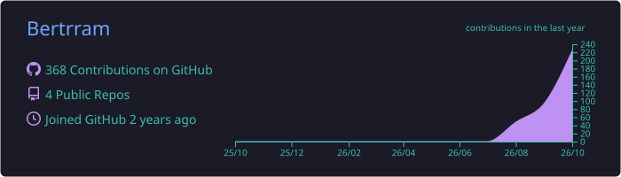
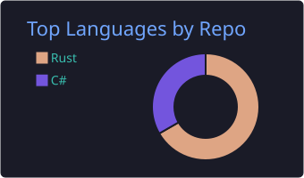
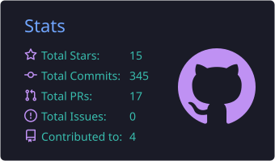

## Player 1

I'm Bertram. I study data science, and on the side I build software, mostly
for games and for Windows. Most of my time right now goes into
[Omoio](https://omoio.app).

|                     |                                                              |
| ------------------- | ------------------------------------------------------------ |
| **Class**           | Data science student, indie dev                              |
| **Main quest**      | [Omoio](https://omoio.app)                                   |
| **Skills**          | Rust, TypeScript, Tauri, C#, .NET                            |
| **Now playing**     | Minecraft, Terraria, SnowRunner, Skylanders, anything Nintendo |
| **Party chat**      | Discord `bertrram`                                           |

## Main quest: Omoio

Omoio puts your PS3 and Wii U games in one library on Windows. Press Play and
it installs RPCS3 or Cemu, sets up your controller and starts the game in its
own window. It has a Big Picture mode for the TV, and a Skylanders portal menu
that puts figures on the portal straight from your controller.

**[omoio.app](https://omoio.app)** ·
[1 minute video](https://youtu.be/wWmthRdoImE) ·
[Source](https://github.com/Bertrram/omoio)

## Side quests

|                                                                      |                                                                                                    |
| -------------------------------------------------------------------- | -------------------------------------------------------------------------------------------------- |
| [**recode**](https://github.com/Bertrram/recode)                     | Convert images from the right-click menu in Windows Explorer. HEIC, AVIF, WebP, JPEG, PNG and more, with nothing extra to install. |
| [**omoio-portraits**](https://github.com/Bertrram/omoio-portraits)   | Reads the figure pictures out of your own copy of Skylanders SWAP Force for Omoio's portal menu.   |

## High scores

<picture>
  <source media="(prefers-color-scheme: dark)" srcset="https://raw.githubusercontent.com/Bertrram/Bertrram/output/snake-dark.svg" />
  
</picture>

---

Tried Omoio and something broke? [Open an issue](https://github.com/Bertrram/omoio/issues).

